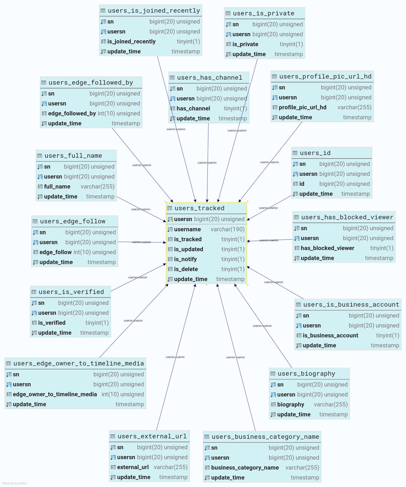

# Instagram parser

Консольное приложение на php и MySQL. 

Собирает и сохраняет публичные сведения об аккаунтах выбранных instagram пользователей. Забирает доступные без авторизации в instagram данные с официального сайта и разбирает их по таблицам отслеживаемых полей. Инициализация сервиса создает необходимые таблицы по списку. В случае добавления новых полей, скрипт инициализации необходимо запустить вновь. При запуске команды на обновление добавляет/заполняет только изменяемые значения. Добавить/удалить пользователей в/из сервис(а) можно списком. Повторное добавление по списку добавить ранее не добавленных пользователей.
 
 В перспективе планирую добавить web интерфейс.

Что сохраняется и какие таблицы создаются (список из `const ELEMENTS` класса Service):
- **id** - уникальный идентификатор пользователя в сервисе
- **full_name**- указанное в описании аккаунта полное имя пользователя
- **biography** - описание к аккаунту
- **external_url** - ссылка на внешний ресурс пользователя
- **profile_pic_url_hd** - ссылка на аватар пользователя в высоком разрешении
- **business_category_name** - наименование категории бизнеса если аккаунт помечен как бизнес аккаунт
- **edge_followed_by** - количество подписчиков
- **edge_follow** - количество подписок
- **edge_owner_to_timeline_media** - количество постов
- **edge_felix_video_timeline** - ???
- **highlight_reel_count** - ???
- **is_business_account** - маркер бизнес аккаунта
- **is_private** - маркер приватности аккаунта
- **is_verified** - маркер верификации аккаунта в сервисе
- **is_joined_recently** - маркер недавнего создания аккаунта
- **has_channel** - вероятно что-то из ожидаемого в Instagram
- **has_blocked_viewer** - вероятно что-то из ожидаемого в Instagram

## Использует composer компоненты:
1. [Guzzle, an extensible PHP HTTP client](https://github.com/guzzle/guzzle)
2. [Simple and fast HTML parser DiDom](https://github.com/Imangazaliev/DiDOM)

## Установка
- Установка зависимостей:
```
composer install
```
- Создать MySQL базу данных. Т.к. используется PDO, база данных может быть иной.

## Настройка
- Переименовать файл `App/config_example.php` в `App/config.php` и внести недостающие значения. При желании/необходиости есть возможность сменить префикс таблиц в `tablesprefix`.
- В `const ELEMENTS` класса `Service` находится перечень извлекаемых значений, их можно корректировать.

## Инициация
- Создание таблиц необходимых для работы сервиса:
```
php ./console.php -s
```
- Добавление в сервис пользователей по списку из файла `App/users_tracked_init.csv`:
```
php ./console.php -r
```
- Удаление из сервиса пользователей по списку из файла `App/users_tracked_init.csv`:
```
php ./console.php -с
```

## Использование
- Добавление пользователя в севис:
 ```
 php ./console.php -a new_user_name
 ```
- Обновление данных (добавить в `crontab` с нужной периодичностью) в сервисе свежими данными из Instagram: 
```
php ./console.php -u
```
- Получить информацию указанного пользователя из Instagram:
```
php ./console.php -i user_name
```
- Получить информацию указанного пользователя из сервиса (базы данных):
```
php ./console.php -b user_name
```
- Удалить пользователя из сервиса (установка маркера `is_delete`):
```
php ./console.php -d user_name
```
Удалить полнотью - MySQL: `DELETE FROM users_tracked WHERE username = '';`. Удалится пользователь из таблицы `users_tracked` и связанные с ним строки в других таблицах (используется `ON DELETE CASCADE`).

## Структура базы данных


### Welcome report
```
Welcome to Instagram parser! 

initializing:                       -s
add default users:                  -r
delete default users:               -c
update users data in service:       -u
add user:                           -a some_user_name
get user info from instagram:       -i some_user_name
get user info from database:        -b some_user_name
delete user:                        -d some_user_name
```

### Instagram info report
```
-----------------------------------
 Public info
-----------------------------------
 Full name:          NASA
 Description:        Explore the universe and discover our home planet with the official NASA Instagram account
 Business_category:  Government Agencies
 Account:            verified, public
 External url:       http://www.nasa.gov/
 Instagram url:      https://instagram.com/nasa

-----------------------------------
 Countable
-----------------------------------
 Posts:              2624
 Followers:          43353016
 Following:          84

-----------------------------------
 Metadata
-----------------------------------
 Instagram id:       528817151
 Service sn:         22
 Set update:         2019-05-28 18:38:36
```

## Примеры MySQL запросов

###### Подсчитать количество пользователей в таблице `users_tracked`
```
SELECT count(username) AS 'count username'
FROM users_tracked;
```

###### Подсчитать количество отслеживаемых пользователей в таблице `users_tracked`
```
SELECT count(username) AS 'count username'
FROM users_tracked
WHERE is_tracked = TRUE;
```

###### Выбрать все уникальные названия категорий бизнеса
```
SELECT DISTINCT business_category_name
FROM users_business_category_name
WHERE business_category_name IS NOT NULL;

+---------------------------------------------+
| business_category_name                      |
+---------------------------------------------+
| Creators & Celebrities                      |
| Personal Goods & General Merchandise Stores |
| Publishers                                  |
| Government Agencies                         |
| Content & Apps                              |
+---------------------------------------------+
```
###### Выбрать имена пользователей у которых бизнес аккаунт и название категории бизнеса
```
SELECT users_tracked.username, users_business_category_name.business_category_name
FROM users_tracked,
     users_is_business_account,
     users_business_category_name
WHERE is_business_account = 1
  AND users_is_business_account.userid = users_tracked.id
  AND users_business_category_name.userid = users_tracked.id;
  
  +-----------------+---------------------------------------------+
  | username        | business_category_name                      |
  +-----------------+---------------------------------------------+
  | gethandsdirty   | Creators & Celebrities                      |
  | victoriassecret | Personal Goods & General Merchandise Stores |
  | natgeo          | Publishers                                  |
  | nasa            | Government Agencies                         |
  | therock         | Creators & Celebrities                      |
  | starwars        | Content & Apps                              |
  +-----------------+---------------------------------------------+

  ```
  ## Some Instagram business_category_name
  - Content & Apps
  - Creators & Celebrities
  - Food & Personal Goods
  - General Interest
  - Government Agencies
  - Local Events
  - Personal Goods & General Merchandise Stores
  - Publishers